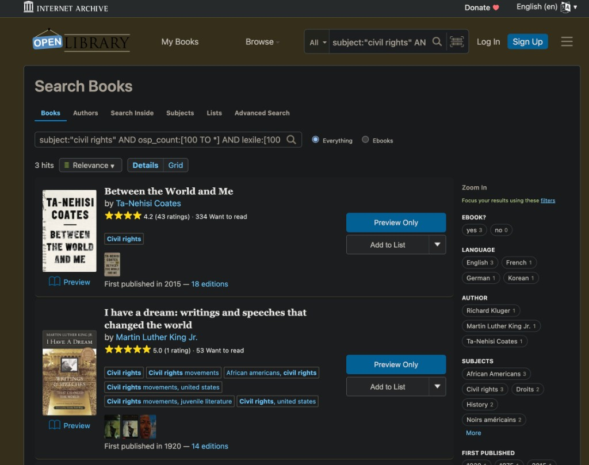

# How to Use Open Library Search

Open Library Search is a very powerful and under-utilized tool. You can specify different fields in the search box to narrow your search results by fields such as author, subject, publication year, and more, listed below. This guide is organized in three sections:
1) Field cheatsheet — how to construct a query and simple examples.
2) Demo — an example of creating a civil rights curriculum for high school students, to showcase the possibilities when fields are combined.
3) Advanced topics — for users who want to further refine queries or use the developer API.

---

## Query cheatsheet
Paste queries into the [search box](https://openlibrary.org/search).

| Field | What the field means | Possible values | Example queries → what they find |
|-------|------------------------|-----------------|----------------------------------|
| `title` | Words that appear in the title | Any words | `title:flammable` → “flammable” anywhere in the title  `title:"pride and prejudice"` → the entire phrase is in the title |
| `author` | **Author/creator names** | Possible values are in this list of [author names](https://openlibrary.org/search/authors). | `author:solnit` → author field matches “solnit”  `author:"rebecca solnit"` → phrase-style match when quoted |
| `subject` | What the book is about. | Community members contribute "subject tags", which are fuzzy, open-field phrases. There is no official master list of subject tags, and books about the same concept may have different tags (for example, a book may have "tennis" but not "sports", or vice versa.) | `subject:tennis rules` → subjects include **tennis** and **rules**  `subject:"civil rights"` → subject would include the entire phrase “civil rights”  `subject:biography` → biographies |
| `language` | **Language** of at least one edition. | [ISO 639-2 three-letter codes](https://www.loc.gov/standards/iso639-2/php/code_list.php) such as `eng`, `spa`, `jpn`. | `language:spa` → at least one Spanish edition |
| `publisher` | **Publisher** name on editions. | There is no official list, and there can be many variants of strings to refer to one publisher. | `publisher:harper` → publisher string contains “harper”. |
| `ebook_access` | **Online readability** for the work (best edition’s access level in the index). | `no_ebook`, `unclassified`, `printdisabled` (preview-only for print-disabled users), `borrowable`, `public`. | `ebook_access:no_ebook AND -ia:*` → a range spanning anything **borrowable** or **public**  `ebook_access:no_ebook AND -ia:* AND readinglog_count:[25 TO *]` → highly requested books that the Internet Archive does not have |
| `publish_year` | **Publication year** of edition(s). | Integers; Solr range syntax `[low TO high]`, `[* TO YYYY]` for “up to”. | `publish_year:2002` → published in 2002  `publish_year:[* TO 1800]` → published any time before 1800  `publish_year:[1900 TO 1950]` → published between 1900–1950 |
| `number_of_pages` | **Page count** for an edition (when the catalog has it). | Non-negative integers; Solr range syntax. | `number_of_pages:[400 TO *]` → editions with 400+ pages  |
| `first_publish_year` | **First year** the work was published (not a specific edition’s year). | Integers; Solr range syntax. Note: there is **no dedicated UI** for this on the main search yet—type it in the query box. | `first_publish_year:[1200 TO 1400]` → first published between 1200 and 1400. |
| `readinglog_count` | Total user adds to **reading logs** (Want to Read + Currently Reading + Already Read). | Non-negative counts; Solr range syntax. | `readinglog_count:[100 TO *]` → on more than 100 patrons’ shelves combined. |
| `ratings_count` | Number of **star ratings** on the work. | Non-negative counts; Solr range syntax. | `ratings_count:[100 TO *]` → more than 100 ratings. |
| `lexile` | **[Lexile](https://www.lexile.com/)** measure of reading difficulty (when the work has a score). | Score ranges; **most works have no Lexile** in the index. | `lexile:[100 TO 900]` → works between 100–900 reading level  See demo below for more explanation. |
| `osp_count` | **[Open Syllabus Project](https://opensyllabus.org/)** count—how often the work appears in OSP’s **college** syllabus collection (aggregate only). | Non-negative counts; Solr ranges. Does not list which schools or courses. Sort in the URL with `&sort=osp_count+desc` (not in the main search UI). | `osp_count:[100 TO *]` → at least 100 syllabus hits in OSP data  `subject:"civil rights" AND osp_count:[100 TO *]` → civil rights titles with strong OSP presence |
| `birth_date` | **Author birth year** | Four-digit years when indexed. | `birth_date:1973` → authors born in 1973. |
| `ddc` | **Dewey Decimal Classification** on editions. | Dewey numbers; wildcards (`200*`, `2*`) and ranges; [DDC browse](https://openlibrary.org/search?q=ddc%3A*&mode=everything). | `ddc:200*` → matches e.g. `200`, `200.25` (not `002.5` for `2*`)  `ddc:[150 TO 160]` → inclusive Dewey band |
| `lcc` | **Library of Congress** call numbers. | Prefixes and patterns; [LCC browse](https://openlibrary.org/search?q=lcc%3A*&mode=everything). | `lcc:A*` → A-class (e.g. `A123`, `AC123.5C12`)  `lcc:[B TO C]` → inclusive letter range |

---

## Combining query fields
Queries can be combined with the logical operators **AND**, **OR**, and **NOT**.
- **AND** (or a space between field clauses) — every part must match.  
- **OR** — at least one side must match; use **parentheses** when OR sits next to other terms so grouping is clear.  
- **NOT** — exclude matches (often `NOT` or a leading `-` on a field, depending on context).

Examples:
- `title:whale OR title:whales` — title contains “whale” **or** “whales”.  
- `subject:dogs subject:("Juvenile fiction" OR "Juvenile literature")` — children's books about dogs  
- `number_of_pages:[400 TO *] subject:biography` — biographies over 400 pages  
- `subject:horror AND edition_count:1` — horror with exactly one edition  
- `subject:horror AND NOT author_key:*` — horror with no author  

# Demo: High School Civil Rights Curriculum

This demo shows how you can use the Search API to build a subject-specific curriculum for any grade level - say, "civil rights curriculum for a high school student."  

To do this, we show how to use three signals from the index:
1. **Filter by subject** — What topic should the book be about?
2. **Filter by Open Syllabus Project signal** — How many times does a book appear in college syllabi?
3. **Filter by Lexile band** — What reading level is the book?

You can test your queries by pasting the query string directly in the [search box on Open Library](https://openlibrary.org/search?) or by constructing the URL using parameters as described in https://openlibrary.org/search/howto and pasting in the browser.

## Subject

The subject filter allows you to filter books by subject/topic - what is this book about?

However, the subject filter is a loose match. There is no official, complete list of allowed values you can download and pick from. Instead, works carry **subject tags** that grow over time: librarians and volunteers add them without enforcing one global standard on every book.

Subject tags also do not have any relational/parent-child structure. For example, books with `subject:"civil rights"` are not a subset of books with `subject:"history"`.

For example, the query `subject:"civil rights"` includes historical fiction in its results, such as *Homeland* by Cory Doctorow.

The query `subject:"civil rights" AND subject:"nonfiction"` eliminates *Homeland*, but also incorrectly eliminates *I Have a Dream* by Martin Luther King Jr.

In this case, `subject:"civil rights" AND subject:"history"` gave the best results of civil rights nonfiction books. 

In general, subject filtering is more of an art than a science - users are encouraged to try a variety of keywords.

## Open Syllabus Project

The [Open Syllabus Project](https://opensyllabus.org/) (OSP) collects large sets of course syllabi from higher education institutions and aggregates which books and texts are assigned. Because the OSP count is an aggregate, the API has several limitations:
- You cannot find a list of which high schools or colleges assigned a given book.
- You cannot find which courses a book was assigned for.
- The OSP count lacks complete coverage of all syllabi worldwide — only what OSP has in **their** collection.

The most basic usage is to filter by OSP count: `subject:"civil rights" AND osp_count:[100 TO *]` shows results with OSP count >= 100. By default, results are sorted by relevance.

Here are some sample results from running this query in April 2026. Note that you may not get the exact same results, as relevance order can shift as records change. You can see live results [here](https://openlibrary.org/search?q=subject%3A%22civil+rights%22+AND+osp_count%3A%5B100+TO+*%5D).
| Title | Authors | Lexile | OSP count |
|-------|---------|--------|-------------|
| [*Up from Slavery*](https://openlibrary.org/works/OL357501W) | Booker T. Washington | — | 924 |
| [*Rights of Man*](https://openlibrary.org/works/OL60359W) | Thomas Paine | — | 1458 |
| [*The Souls of Black Folk*](https://openlibrary.org/works/OL28577W) | W. E. B. Du Bois | — | 4328 |
| [*Twelve years a slave*](https://openlibrary.org/works/OL78871W) | Solomon Northup | — | 432 |
| [*The fire next time*](https://openlibrary.org/works/OL2683364W) | James Baldwin | — | 1223 |

You might want to sort by OSP count rather than filtering if you're not sure what a good filtering threshold would be. 

Unfortunately, the **search box** and UI on [openlibrary.org](https://openlibrary.org) do not support sorting by OSP count.

Instead, after you search, add **`&sort=osp_count+desc`** (or `+asc`) to the address bar, for example: https://openlibrary.org/search?q=civil+rights&sort=osp_count+desc.

**Sample results** when using that sort (April 2026 snapshot; order and counts can change):
| Title | Authors | Lexile | OSP count |
|-------|---------|--------|-------------|
| [*The Souls of Black Folk*](https://openlibrary.org/works/OL28577W) | W. E. B. Du Bois | — | 4328 |
| [*The New Jim Crow*](https://openlibrary.org/works/OL13826369W) | Michelle Alexander | — | 3920 |
| [*Letter from the Birmingham jail*](https://openlibrary.org/works/OL1945913W) | Martin Luther King Jr., Dion Graham | — | 3184 |

The Open Library UI does not show Lexile or OSP count. To see those values, use **`GET https://openlibrary.org/search.json` with the same query parameters as the normal results page (`/search?…`), but use the path `/search.json` instead. Paste the full URL into a browser address bar or request it with **`curl`** to see the raw JSON.

In the previous example of https://openlibrary.org/search?q=civil+rights&sort=osp_count+desc, the corresponding JSON output can be seen at: [https://openlibrary.org/search.json?q=civil+rights&sort=osp_count+desc](https://openlibrary.org/search.json?q=civil+rights&sort=osp_count+desc).

### Lexile - Reading Level

[Lexile](https://www.lexile.com/) measures the “reading difficulty” of a text. Specifically, Lexile captures **linguistic complexity** (vocabulary, syntax, cohesion).

Here's a rough guide mapping Lexile scores to reading level:

| Stage | Typical Lexile range (text)* | Example texts (approx. Lexile)** |
|-------|------------------------------|-----------------------------------|
| Grade 1 | 190L–530L | [*Green Eggs and Ham*](https://openlibrary.org/works/OL1898308W) (210L) |
| Grade 2 | 420L–650L | [*Henry and Mudge*](https://openlibrary.org/works/OL64034W) (450L) |
| Grade 3 | 520L–820L | [*Charlotte’s Web*](https://openlibrary.org/works/OL483391W) (680L) |
| Grade 4 | 740L–940L | [*Harry Potter and the Sorcerer’s Stone*](https://openlibrary.org/works/OL28649132W) (880L) |
| Grades 5–6 | 830L–1070L | [*Island of the Blue Dolphins*](https://openlibrary.org/works/OL4466828W) (1000L); [*The Hobbit*](https://openlibrary.org/works/OL27482W) (1000L) |
| Grades 7–8 | 970L–1160L | [*Fahrenheit 451*](https://openlibrary.org/works/OL103123W) (1030L); [*The Great Gatsby*](https://openlibrary.org/works/OL468431W) (1010L) |
| Grades 9–10 | 1050L–1230L | [*Brave New World*](https://openlibrary.org/works/OL64365W) (1090L); [*1984*](https://openlibrary.org/works/OL1168083W) (1170L) |
| Grades 11–12 | 1185L–1385L | [*The Scarlet Letter*](https://openlibrary.org/works/OL455305W) (1200L); [*Moby-Dick*](https://openlibrary.org/works/OL102749W) (1200L–1380L) |
| College | 1185L–1390L | [*A Brief History of Time*](https://openlibrary.org/works/OL1892617W) (1200L); [*The Republic*](https://openlibrary.org/works/OL34723025W) (1310L) |
| Beyond | 1400L+ | [*Guns, germs, and steel*](https://openlibrary.org/works/OL276558W) (1440L); [*Absalom, Absalom!*](https://openlibrary.org/works/OL82928W) (1570L) |
| No Lexile | — | [*Understanding Supreme Court opinions*](https://openlibrary.org/works/OL3244259W); [*Infinite Jest*](https://openlibrary.org/works/OL2943602W); [*Advanced Engineering Mathematics*](https://openlibrary.org/works/OL1400344W) |

Unfortunately, 99% of books on Open Library do not have a Lexile score. MetaMetrics, the creator of Lexile, does not score every published book. Whether a book is scored depends on publisher and partner programs. 

For example, to create a civil rights curriculum for elementary school children, query `subject:"civil rights" AND lexile:[100 TO 900] AND osp_count:[1 TO *]`. For high school students, query `subject:"civil rights" AND lexile:[1000 TO 1385]`.

---

# Advanced Topics

## Advanced queries for subject

- `subject:happy` — fuzzy match on subjects (same pattern for `place`, `time`, `person`).  
- `place:rome` — Rome as a **place** (not only the word in a generic subject).  
- `place:lisbon` — books about Lisbon.  
- `person:rosa parks` — people with **rosa** and **parks** in the person field.  
- `title_suggest:"vitamin a"` — uses the [non-stemmed](https://en.wikipedia.org/wiki/Stemming) suggest field.  
- `subject:travel place:istanbul` — books about travel in Istanbul.  

There are multiple ways to search for books by a subject. The primary way is to use the subject: field which will do a fuzzy search for any books with subjects containing your search (e.g. subject:happy would match a subject of "happy feet"). This is also the case for place, time, and person.

An exact subject match can be performed using the subject_key: field. Presently, this value needs to be normalized such that spaces and special characters like / become underscores and the entire term becomes lowercased. For instance (a subject like "Metropolitan Museum of Art (New York, N.Y.)" becomes metropolitan_museum_of_art_(new_york_n.y.)). Here's the code behind the scenes for those who need more details. Note that _key can be added to place, time, and person to achieve the same exact matching capabilities.

place:rome will find you subjects about Rome that relate to the city; the place. Other types are time & person.
To do a negative search on Open Library, you can use the -subject_key operator. For example, to find all the books that show up for the word "solr" that don't have the subject "Apache Solr", you would use the following search query:

https://openlibrary.org/search?q=solr+-subject_key%3A%22apache_solr%22&mode=everything

Note that the subject key is the subject name with some normalization applied (lower case, spaces converted to underscores).

Here is an example of a negative search in action:

https://openlibrary.org/search?q=machine+learning+-subject_key%3A%22python%22&mode=everything

This search will return all the books about machine learning that do not have the subject "Python".

Negative searches can be useful for finding books on a specific topic that are not limited to a particular programming language or framework. They can also be used to find books that are more general in nature.

Perform an exact search for subject using the subject_key field, e.g:
subject_key:fantasy

## Developer API
Use `/search.json?` instead of `/search?` in the URL for JSON responses. See the [Developer Center](https://openlibrary.org/developers) and [Search API](https://openlibrary.org/dev/docs/api/search) documentation. The Search API provides the ability to sort, paginate, and limit the number of results, which is not currently available on the UI.

## FAQ / Debugging Queries

### No results were returned.

Lexile scores and OSP counts are not on every work, and they don’t always overlap.
For example:
- A query that requires `subject_key:economics` plus a Lexile band plus `osp_count:[1 TO *]` may legitimately return `numFound: 0`.
- Fewer constraints (for example, drop `osp_count:[1 TO *]` but keep `sort=osp_count desc`) still surfaces `osp_count` when present and ranks OSP-heavy titles first, while showing other matches with missing or lower OSP.

### Results included off-topic books.

Search is fuzzy and imprecise by default. A book can surface because a substring or related heading matches, not only because it is “really” about your topic in everyday terms.

Curriculum builders should expect to combine headings (`subject:"civil rights" AND subject:history`), try synonyms, or start from known good books and reuse their exact `subject_key` values.

### Can I limit results to a single-word title (e.g. “hands”)?
It is not possible to do this currently but you could try excluding some words from the title and using alphabetical search (see this alphabetical search issue)[https://github.com/internetarchive/openlibrary/issues/2796] like [this](https://openlibrary.org/search?language=eng&page=83&sort=title&q=title%3Ahands+-title%3Aa+-title%3Athe+-title%3Aand+-title%3Aan+-title%3Ain+-title%3Aon+-title%3Ato+-title%3Afor+-title%3Abook+-title%3Aoff+-title%3Aup+-title%3Aover+-title%3Aof+-title%3Aall+-title%3Apuppet+-title%3Aher+-title%3Atools+-title%3Abare+-title%3Abasic&mode=everything).

### More resources
Some of these tips are demonstrated in this [instructional video](youtube.com/watch?v=ki3ySbC1bHs&feature=youtu.be).